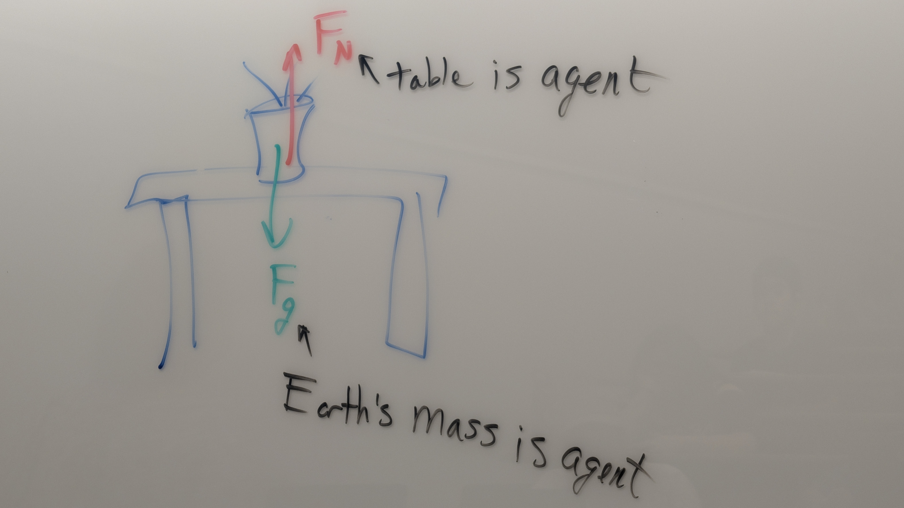

Weight (Fg) is the force of gravity and is different than an object's mass; always down!

## FORCE DIAGRAMS (FREE-BODY DIAGRAMS)
Fbd HELP VISUALIZE HOW FORCES ARE INTERACTING
CREATING A FORCE DIAGRAM: 
1. EACH FBD IS FOR A SINGLE "OBJECT"
2. REPRESENT THE OBJECT WITH A DRAWING OR DOT
3. DRAW ALL THE FORCES ON THE OBJECT AS ARROWS
4. LABEL EACH FORCE WITH AN APPROPRIATE NAME
5. CHECK: FOR EACH FORCE YOU KNOW: OBJECT EXERTING IT, OBJECT IT ACTS ON, CONTACT/NO CONTACT?

